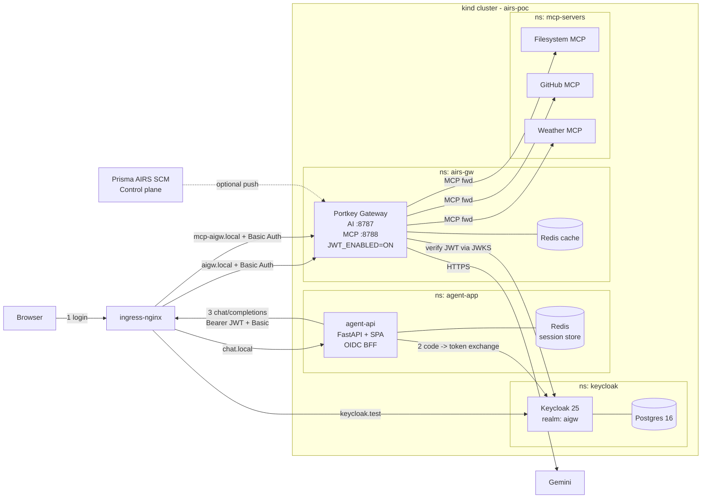

# Prisma AIRS AIGW — End-to-End Installation Guide

**Purpose:** Reproduce the complete **Prisma AIRS AI Gateway hybrid POC** on a fresh laptop from zero. Every prerequisite, every credential, every command, every manual click, every verification step is documented here so that any user can replicate the setup end-to-end without prior knowledge of the repo.

**Outcome after following this guide:**

- A `kind` Kubernetes cluster (`airs-poc`) running on your laptop
- **Keycloak 25** (OIDC IdP) with a pre-seeded realm `aigw` and 3 users (alice, bob, kcadmin)
- **Portkey AI Gateway** protected by ingress **Basic Auth** + **JWT** validation against Keycloak
- **3 MCP tool servers** (Filesystem, GitHub, Weather) fronted by the gateway
- A **LangGraph agent-api** (FastAPI + SPA) that logs users in via OIDC (BFF pattern) and forwards per-user JWTs to the gateway
- A **Redis session store** so sessions survive pod restarts
- Optional wire-up to **Prisma AIRS SCM control plane** for runtime scanning and per-user guardrails

**Estimated time:** 20–35 minutes end-to-end (most of it is Docker image pulls + Keycloak first-boot).

---

## Table of Contents

1. [Architecture recap](#1-architecture-recap)
2. [Prerequisites (host machine)](#2-prerequisites-host-machine)
3. [External accounts + API keys you must obtain first](#3-external-accounts--api-keys-you-must-obtain-first)
4. [Clone the repository](#4-clone-the-repository)
5. [Configure the `.env` file](#5-configure-the-env-file)
6. [Automated one-command deploy](#6-automated-one-command-deploy)
7. [Manual deploy (step-by-step, if you skip `deploy.sh`)](#7-manual-deploy-step-by-step-if-you-skip-deploysh)
8. [Post-deploy verification](#8-post-deploy-verification)
9. [First-time login walkthrough (browser)](#9-first-time-login-walkthrough-browser)
10. [Optional — wire the data plane to Prisma AIRS SCM](#10-optional--wire-the-data-plane-to-prisma-airs-scm-control-plane)
11. [Restarting the stack after a laptop reboot](#11-restarting-the-stack-after-a-laptop-reboot)
12. [Common failures & fixes](#12-common-failures--fixes)
13. [Secret hygiene — where credentials live and how to keep them safe](#13-secret-hygiene--where-credentials-live-and-how-to-keep-them-safe)
14. [Rotating secrets / passwords](#14-rotating-secrets--passwords)
15. [Teardown](#15-teardown)
16. [Appendix A — files & what they do](#appendix-a--files--what-they-do)
17. [Appendix B — `/etc/hosts` reference](#appendix-b--etchosts-reference)
18. [Appendix C — Port map & namespace map](#appendix-c--port-map--namespace-map)

---

## 1. Architecture recap



**Namespaces created:** `ingress-nginx`, `keycloak`, `airs-gw`, `mcp-servers`, `agent-app`.

---

## 2. Prerequisites (host machine)

### 2.1 Supported OS

- **macOS 13+** (Intel or Apple Silicon) — primary target of this POC.
- **Linux (Ubuntu 22.04+ / Debian / Fedora)** — works with the same commands (`apt`/`dnf` in place of `brew`).
- **Windows** — use WSL2 + Docker Desktop with WSL integration.

### 2.2 Hardware minimums

| Resource | Minimum | Recommended |
|---|---|---|
| CPU | 4 cores | 8 cores |
| RAM | 8 GB free | 16 GB free (Keycloak + Portkey + 3 MCP + 2 Redis is heavy) |
| Disk | 15 GB free | 30 GB free (Docker images + Postgres PVC) |

### 2.3 Required software

Install these **once** on the host:

| Tool | Purpose | macOS install |
|---|---|---|
| **Docker Desktop 4.20+** | container runtime for kind nodes | `brew install --cask docker` — then launch it so the daemon runs |
| **kind ≥ 0.20** | Kubernetes-in-Docker cluster | `brew install kind` |
| **kubectl ≥ 1.28** | Kubernetes CLI | `brew install kubectl` |
| **Python 3.11+** | needed for smoke-test agent + bcrypt fallback in [`deploy.sh`](deploy.sh:142) | `brew install python@3.11` |
| **openssl** | random secret generation | pre-installed on macOS |
| **htpasswd** *(optional)* | bcrypt htpasswd for ingress Basic Auth (script falls back to Python `bcrypt` if missing) | `brew install httpd` |
| **jq** *(optional)* | pretty-print JSON in verification snippets | `brew install jq` |
| **git** | clone this repository | `brew install git` |
| **sudo** access | one-time write to `/etc/hosts` | built-in |

**Linux equivalents** (Ubuntu/Debian):

```bash
sudo apt update
sudo apt install -y docker.io python3 python3-venv python3-pip apache2-utils jq git openssl curl
# kind + kubectl — follow their official install docs, or:
curl -Lo ./kind https://kind.sigs.k8s.io/dl/v0.24.0/kind-linux-amd64 && chmod +x ./kind && sudo mv ./kind /usr/local/bin/
curl -LO "https://dl.k8s.io/release/$(curl -Ls https://dl.k8s.io/release/stable.txt)/bin/linux/amd64/kubectl" && chmod +x kubectl && sudo mv kubectl /usr/local/bin/
sudo usermod -aG docker $USER    # then log out + back in
```

### 2.4 Sanity check

Run all of these and confirm they print a version (not an error):

```bash
docker version
docker info | grep -i 'server version'
kind version
kubectl version --client
python3 --version
openssl version
```

If Docker Desktop is not running, start it before proceeding (`open -a Docker` on macOS).

### 2.5 Free the required host ports

The `kind` cluster maps host ports **80** and **443** for ingress-nginx (see [`kind/cluster.yaml`](kind/cluster.yaml:14)). Make sure nothing else is bound to them:

```bash
lsof -iTCP:80  -sTCP:LISTEN
lsof -iTCP:443 -sTCP:LISTEN
```

Common conflicts: local Apache (`sudo apachectl stop`), a previous nginx, or another kind cluster. Kill/stop them first.

---

## 3. External accounts + API keys you must obtain first

Register / generate all four of these **before** you edit `.env`. All have free tiers.

### 3.1 Google AI Studio — Gemini API key (REQUIRED)

1. Go to <https://aistudio.google.com/apikey>.
2. Sign in with a Google account.
3. Click **Create API key** → **Create API key in new project** (or pick an existing GCP project).
4. Copy the key. It looks like `AIzaSy...` (~39 chars). Keep it secret.
5. This becomes `GEMINI_API_KEY` in [`.env`](.env.example:20).

**Cost:** Free tier is generous (Gemini 2.5 Flash is included). No billing card required.

### 3.2 GitHub Personal Access Token (REQUIRED)

The GitHub MCP server needs a PAT with **`repo:read`** scope so the agent can list issues / PRs / files.

1. Go to <https://github.com/settings/tokens>.
2. **Generate new token → Fine-grained personal access token** (recommended) OR classic token.
3. **Fine-grained**: pick the repos you want to expose to the agent, then under **Repository permissions** set:
   - `Contents: Read-only`
   - `Issues: Read-only`
   - `Pull requests: Read-only`
   - `Metadata: Read-only` *(auto-selected)*
4. **Classic** (simpler): tick the `repo` scope (or `public_repo` for read-only public work).
5. Set expiration (30–90 days is fine for a POC), click **Generate**, copy the token.
6. It looks like `ghp_...` (classic) or `github_pat_...` (fine-grained).
7. This becomes `GITHUB_TOKEN` in [`.env`](.env.example:24).

### 3.3 OpenWeather API key (REQUIRED)

The Weather MCP server proxies to OpenWeatherMap.

1. Go to <https://openweathermap.org/api> → click **Sign up** (top-right).
2. Verify your email.
3. In the account dashboard → **API keys** tab → copy the **default** key (or **Generate** a new one named `aigw-poc`).
4. **Wait ~10 minutes** — new keys take a few minutes to become active.
5. This becomes `OPENWEATHER_API_KEY` in [`.env`](.env.example:27).

### 3.4 Prisma AIRS SCM tenant (OPTIONAL — only for §10)

Only needed if you want to wire the runtime scanner and per-user guardrails. Skip if you just want the local stack.

- URL: <https://stratacloudmanager.paloaltonetworks.com>
- You need a workspace in which **AI Runtime Security → AI Gateway** is enabled.
- From SCM you will later collect:
  - `ORGANISATIONS_TO_SYNC` (org UUID)
  - `PORTKEY_CLIENT_AUTH` (long token)
  - `ALBUS_BASEPATH` (usually `https://albus.portkey.ai`)

Do **not** paste these into `.env` — they are wired via a `kubectl patch` in §10.

---

## 4. Clone the repository

```bash
git clone <your-fork-or-origin-url>.git AIGW
cd AIGW
```

Confirm the layout:

```bash
ls
# Expected top-level entries:
# .env.example  deploy.sh  teardown.sh  Makefile  README.md
# agent/  agent-api/  configs/  keycloak/  kind/  manifests/  mcp-weather/  docs/
```

---

## 5. Configure the `.env` file

### 5.1 Copy the template

```bash
cp .env.example .env
```

### 5.2 Edit `.env` and fill in these values

Open `.env` in your editor (`code .env`, `vim .env`, `nano .env` — your call). Every variable is documented inline in [`.env.example`](.env.example:1). The required ones are:

| Variable | Where it comes from | Example |
|---|---|---|
| `AIGW_USER` | **you choose** — ingress Basic Auth username | `aigwuser` |
| `AIGW_PASS` | **you choose** — ingress Basic Auth password (strong!) | `S0me-Str0ng-P@ss` |
| `CHAT_USER` | **you choose** — legacy SPA login username (fallback for `?legacy=1`) | `admin` |
| `CHAT_PASS` | **you choose** — legacy SPA login password (strong!) | `An0ther-Str0ng-P@ss` |
| `CHAT_SESSION_SECRET` | leave the `CHANGE_ME_LONG_RANDOM_HEX` placeholder and `deploy.sh` will auto-generate a 64-hex-char secret — OR pre-generate with `openssl rand -hex 32` and paste it in to keep session cookies stable across re-deploys | `9a3f...` |
| `GEMINI_API_KEY` | §3.1 above | `AIzaSy...` |
| `GITHUB_TOKEN` | §3.2 above | `ghp_...` |
| `OPENWEATHER_API_KEY` | §3.3 above | `f3c2...` |
| `OIDC_CLIENT_ID` | leave default `aigw-chat` unless you edited the realm import | `aigw-chat` |
| `OIDC_CLIENT_SECRET` | leave default `aigw-chat-client-secret-CHANGE-ME` **for POC only**. Must match [`keycloak/04-realm-import-configmap.yaml`](keycloak/04-realm-import-configmap.yaml:1) | `aigw-chat-client-secret-CHANGE-ME` |
| `GEMINI_MODEL` | optional override; default `gemini-2.5-flash` is fine | `gemini-2.5-flash` |

### 5.3 Verify the file

```bash
grep -Ev '^#|^$' .env
```

Every line should have a real value on the right of the `=`. **Do not commit this file** — `.gitignore` already excludes it.

### 5.4 Rotate defaults if you plan to keep this longer than a POC

The following defaults are hard-coded in manifests and MUST be rotated for anything beyond a laptop demo. See §12 for full rotation procedure.

- Keycloak admin password: `kc-admin-poc-CHANGE-ME` in [`keycloak/03-keycloak-secret.yaml`](keycloak/03-keycloak-secret.yaml:1)
- Postgres password: `POSTGRES_PASSWORD` in [`keycloak/01-postgres-secret.yaml`](keycloak/01-postgres-secret.yaml:1)
- OIDC client secret: `aigw-chat-client-secret-CHANGE-ME` in [`keycloak/04-realm-import-configmap.yaml`](keycloak/04-realm-import-configmap.yaml:1) **AND** matching value in `.env`
- Seeded user passwords (alice/bob/kcadmin): [`keycloak/04-realm-import-configmap.yaml`](keycloak/04-realm-import-configmap.yaml:1)

---

## 6. Automated one-command deploy

Once `.env` is filled in, run:

```bash
./deploy.sh
```

That's it. The script is **idempotent** — safe to re-run any number of times.

### 6.1 What `deploy.sh` does (12 steps)

Each step is announced with `==>` in the terminal (from [`deploy.sh`](deploy.sh:23)). If any step fails, the script exits and prints the failing command.

| # | Step | What happens |
|---|---|---|
| 0 | Prereq check | Verifies `docker`, `kind`, `kubectl`, `python3` are on `PATH`. Warns if `htpasswd` is missing (falls back to `bcrypt`). Verifies docker daemon is running. |
| 1 | Load `.env` | Sources `.env`, enforces required vars, auto-generates `CHAT_SESSION_SECRET` if placeholder. |
| 2 | Create kind cluster `airs-poc` | 1 control-plane + 2 worker nodes (config: [`kind/cluster.yaml`](kind/cluster.yaml:1)). Host ports 80/443 are mapped. |
| 3 | Install `ingress-nginx` v1.11.2 | `kubectl apply -f https://raw.githubusercontent.com/kubernetes/ingress-nginx/controller-v1.11.2/deploy/static/provider/kind/deploy.yaml`. Waits for the controller pod. |
| 4 | Build local images | `mcp-weather:local` and `agent-api:local` (Docker builds). |
| 5 | Load images into kind | `docker save … | docker exec … ctr images import`. Pre-pulls `ghcr.io/github/github-mcp-server:latest` on the host first, since some corporate-proxied kind nodes cannot fetch OCI attestations from GHCR directly. |
| 6 | Create namespaces + secrets | Applies [`manifests/00-namespaces.yaml`](manifests/00-namespaces.yaml:1). Generates a bcrypt htpasswd for ingress Basic Auth, then creates: `airs-gw/basic-auth`, `airs-gw/llm-creds`, `airs-gw/mcp-upstream-creds`, `mcp-servers/mcp-creds`, `agent-app/chat-creds`, `agent-app/llm-creds-mirror`, `agent-app/aigw-basicauth-mirror`, `agent-app/oidc-client`. |
| 7 | Deploy Keycloak 25 + Postgres 16 | Applies [`keycloak/00-`…`06-*.yaml`](keycloak/). Waits for both StatefulSets (**~2 min on first boot** — JPA migration + realm import). |
| 8 | Portkey config → ConfigMap | Loads [`configs/portkey-config.json`](configs/portkey-config.json:1) into `airs-gw/portkey-config`. |
| 9 | Apply workloads | Redis (cache) + Redis (sessions) + all 3 MCP servers + Portkey Gateway + ingress + agent-api. |
| 10 | Wait for rollouts | Timeouts: 120s–240s per Deployment. |
| 11 | Restart `agent-api` | Forces the new `:local` image into the pod even if the tag didn't change. |
| 12 | Patch `/etc/hosts` | `sudo` prompts for password if the line is missing. Adds `127.0.0.1 aigw.local mcp-aigw.local chat.local keycloak.test`. Flushes DNS on macOS. |

### 6.2 Expected final output

You should see (colors trimmed):

```
=========================================================================
 DEPLOY COMPLETE
=========================================================================
 Chat UI (OIDC) : http://chat.local/                    (login via Keycloak)
                    - alice / alice     (group: gemini-users)
                    - bob   / bob       (no groups - should be denied by SCM)
                    - kcadmin / kcadmin (groups: admins, gemini-users)
 Chat UI (legacy) : http://chat.local/?legacy=1         (login: admin)
 Keycloak admin  : http://keycloak.test/                (admin / kc-admin-poc-CHANGE-ME)
 AI Gateway      : http://aigw.local/v1/chat/completions   (Basic Auth: aigwuser  +  Bearer JWT from Keycloak)
 MCP Gateway     : http://mcp-aigw.local/{filesystem|github|weather}/mcp
```

Proceed to §8.

---

## 7. Manual deploy (step-by-step, if you skip `deploy.sh`)

Use this section only if you want to understand every command, or if `deploy.sh` fails part-way and you want to resume from a specific step. Everything here mirrors [`deploy.sh`](deploy.sh:1) 1-for-1.

### Step 7.1 — Load the environment

```bash
set -a; source .env; set +a
```

### Step 7.2 — Create the kind cluster

```bash
kind create cluster --config kind/cluster.yaml
kubectl config use-context kind-airs-poc
kubectl cluster-info
```

### Step 7.3 — Install ingress-nginx

```bash
kubectl apply -f https://raw.githubusercontent.com/kubernetes/ingress-nginx/controller-v1.11.2/deploy/static/provider/kind/deploy.yaml
kubectl -n ingress-nginx wait --for=condition=Ready pod \
  -l app.kubernetes.io/component=controller --timeout=180s
```

### Step 7.4 — Build & load local images

```bash
docker build -t mcp-weather:local ./mcp-weather
docker build -t agent-api:local  ./agent-api
docker pull ghcr.io/github/github-mcp-server:latest

for node in $(kind get nodes --name airs-poc); do
  docker save mcp-weather:local | docker exec -i "$node" ctr --namespace=k8s.io images import -
  docker save agent-api:local   | docker exec -i "$node" ctr --namespace=k8s.io images import -
  docker save ghcr.io/github/github-mcp-server:latest | docker exec -i "$node" ctr --namespace=k8s.io images import -
done
```

### Step 7.5 — Create namespaces

```bash
kubectl apply -f manifests/00-namespaces.yaml
```

### Step 7.6 — Create the ingress Basic Auth secret

```bash
htpasswd -bBc /tmp/aigw.htpasswd "$AIGW_USER" "$AIGW_PASS"
kubectl -n airs-gw create secret generic basic-auth \
  --from-file=auth=/tmp/aigw.htpasswd \
  --dry-run=client -o yaml | kubectl apply -f -
rm /tmp/aigw.htpasswd
```

*If you don't have `htpasswd`, run the Python bcrypt fallback shown in [`deploy.sh`](deploy.sh:142).*

### Step 7.7 — Create the LLM / MCP / chat / OIDC secrets

```bash
kubectl -n airs-gw create secret generic llm-creds \
  --from-literal=GEMINI_API_KEY="$GEMINI_API_KEY" --dry-run=client -o yaml | kubectl apply -f -

kubectl -n airs-gw create secret generic mcp-upstream-creds \
  --from-literal=GITHUB_TOKEN="$GITHUB_TOKEN" --dry-run=client -o yaml | kubectl apply -f -

kubectl -n mcp-servers create secret generic mcp-creds \
  --from-literal=GITHUB_TOKEN="$GITHUB_TOKEN" \
  --from-literal=OPENWEATHER_API_KEY="$OPENWEATHER_API_KEY" \
  --dry-run=client -o yaml | kubectl apply -f -

kubectl -n agent-app create secret generic chat-creds \
  --from-literal=CHAT_USER="$CHAT_USER" \
  --from-literal=CHAT_PASS="$CHAT_PASS" \
  --from-literal=CHAT_SESSION_SECRET="$CHAT_SESSION_SECRET" \
  --dry-run=client -o yaml | kubectl apply -f -

kubectl -n agent-app create secret generic llm-creds-mirror \
  --from-literal=GEMINI_API_KEY="$GEMINI_API_KEY" --dry-run=client -o yaml | kubectl apply -f -

kubectl -n agent-app create secret generic aigw-basicauth-mirror \
  --from-literal=AIGW_USER="$AIGW_USER" \
  --from-literal=AIGW_PASS="$AIGW_PASS" --dry-run=client -o yaml | kubectl apply -f -

kubectl -n agent-app create secret generic oidc-client \
  --from-literal=OIDC_CLIENT_ID="$OIDC_CLIENT_ID" \
  --from-literal=OIDC_CLIENT_SECRET="$OIDC_CLIENT_SECRET" \
  --dry-run=client -o yaml | kubectl apply -f -
```

### Step 7.8 — Deploy Keycloak

```bash
kubectl apply -f keycloak/00-namespace.yaml
kubectl apply -f keycloak/01-postgres-secret.yaml
kubectl apply -f keycloak/02-postgres-statefulset.yaml
kubectl apply -f keycloak/03-keycloak-secret.yaml
kubectl apply -f keycloak/04-realm-import-configmap.yaml
kubectl apply -f keycloak/05-keycloak-statefulset.yaml
kubectl apply -f keycloak/06-keycloak-ingress.yaml

kubectl -n keycloak rollout status statefulset/keycloak-db --timeout=180s
kubectl -n keycloak rollout status statefulset/keycloak    --timeout=360s
```

### Step 7.9 — Load the Portkey ConfigMap

```bash
kubectl -n airs-gw create configmap portkey-config \
  --from-file=config.json=configs/portkey-config.json \
  --dry-run=client -o yaml | kubectl apply -f -
```

### Step 7.10 — Apply application workloads

```bash
kubectl apply -f manifests/20-redis.yaml            # Portkey cache
kubectl apply -f manifests/25-redis-sessions.yaml   # agent-api sessions
kubectl apply -f manifests/50-mcp-filesystem.yaml
kubectl apply -f manifests/51-mcp-github.yaml
kubectl apply -f manifests/52-mcp-weather.yaml
kubectl apply -f manifests/40-portkey-gateway.yaml
kubectl apply -f manifests/60-ingress.yaml
kubectl apply -f manifests/70-agent-api.yaml
```

### Step 7.11 — Wait for rollouts

```bash
kubectl -n airs-gw     rollout status deploy/redis           --timeout=120s
kubectl -n agent-app   rollout status deploy/redis           --timeout=120s
kubectl -n mcp-servers rollout status deploy/mcp-filesystem  --timeout=240s
kubectl -n mcp-servers rollout status deploy/mcp-github      --timeout=240s
kubectl -n mcp-servers rollout status deploy/mcp-weather     --timeout=180s
kubectl -n airs-gw     rollout status deploy/portkey-gateway --timeout=240s
kubectl -n agent-app   rollout status deploy/agent-api       --timeout=180s
```

### Step 7.12 — Patch `/etc/hosts`

```bash
echo "127.0.0.1 aigw.local mcp-aigw.local chat.local keycloak.test" | sudo tee -a /etc/hosts

# macOS only — flush DNS cache
sudo dscacheutil -flushcache
sudo killall -HUP mDNSResponder
```

---

## 8. Post-deploy verification

### 8.1 Everything is Ready

```bash
make status
```

Or explicitly:

```bash
kubectl get pods -A | grep -E 'airs-gw|mcp-servers|agent-app|keycloak|ingress-nginx'
```

Every pod must be `Running` and `READY 1/1` (or `2/2` for supergateway sidecars). If anything is `CrashLoopBackOff`, jump to §11.

### 8.2 Basic Auth on the gateway

```bash
# expect HTTP 401 (no creds)
make curl-health-noauth
# expect HTTP 200 (with creds)
make curl-health
```

### 8.3 OIDC discovery is live

```bash
curl -s http://keycloak.test/realms/aigw/.well-known/openid-configuration | jq '.issuer, .jwks_uri'
```

Expected:

```json
"http://keycloak.test/realms/aigw"
"http://keycloak.test/realms/aigw/protocol/openid-connect/certs"
```

### 8.4 End-to-end JWT smoke test

Fetch a token for `alice` using the direct-grant flow and decode it:

```bash
TOKEN=$(curl -s -X POST http://keycloak.test/realms/aigw/protocol/openid-connect/token \
  -d 'grant_type=password' \
  -d 'client_id=aigw-chat' \
  -d "client_secret=$OIDC_CLIENT_SECRET" \
  -d 'username=alice' -d 'password=alice' \
  -d 'scope=openid email aigw-api' | jq -r .access_token)

echo "$TOKEN" | cut -d. -f2 | base64 -d 2>/dev/null | jq
```

You should see `preferred_username: "alice"`, `groups: ["gemini-users"]`, `aud` containing `aigw-api`.

Now hit the gateway with **both** Basic Auth AND that JWT:

```bash
curl -sS -u "$AIGW_USER:$AIGW_PASS" \
  -H "Authorization: Bearer $TOKEN" \
  -H 'Content-Type: application/json' \
  http://aigw.local/v1/chat/completions \
  -d '{"model":"gemini-2.5-flash","messages":[{"role":"user","content":"Say hi in one short sentence"}]}' | jq
```

Expected: a Gemini response JSON (`choices[0].message.content` populated).

### 8.5 Legacy Basic-Auth smoke tests (no OIDC)

```bash
python3 -m venv .venv && source .venv/bin/activate
pip install -r agent/requirements.txt
make test         # runs agent/test_prompts.py — 5 tests
```

All 5 tests should print ✅.

### 8.6 Redis session store is wired

```bash
kubectl -n agent-app exec deploy/redis -- redis-cli KEYS 'aigw-chat:sid:*'
# after you log in via the browser (§9) this should list one or more keys
```

Session-survival test:

```bash
kubectl -n agent-app rollout restart deploy/agent-api
# reload http://chat.local/ — you should STAY logged in
```

---

## 9. First-time login walkthrough (browser)

1. Open <http://chat.local/> in a fresh Incognito/Private window (avoids stale cookies from previous runs).
2. You are redirected to Keycloak (`http://keycloak.test/realms/aigw/protocol/openid-connect/auth?...`).
3. Log in as one of the seeded users:
   - **alice / alice** — has group `gemini-users`, will succeed.
   - **bob / bob** — no groups, will succeed today (SCM policy in §10 will deny him later).
   - **kcadmin / kcadmin** — admins + gemini-users, bypasses budgets.
4. You are redirected to `http://chat.local/api/auth/callback?code=…`, agent-api exchanges the code for tokens, sets a `chatsid` cookie, and drops you on the chat SPA.
5. Try:
   - `"Hello"` — hits Gemini through the gateway.
   - `"What's the weather in Tokyo?"` — triggers the Weather MCP.
   - `"List files in /data"` — triggers the Filesystem MCP.
   - `"Show me the last 5 issues in owner/repo"` — triggers the GitHub MCP.
6. Click **Logout** — you should be bounced through Keycloak's `end_session_endpoint` and land on a fresh login page. Reloading `chat.local` should re-prompt for credentials.

### 9.1 Keycloak admin console

- URL: <http://keycloak.test/>
- **Master realm** admin: `admin` / `kc-admin-poc-CHANGE-ME` (from [`keycloak/03-keycloak-secret.yaml`](keycloak/03-keycloak-secret.yaml:1)).
- Switch to realm `aigw` in the top-left dropdown to manage the `aigw-chat` client, users, groups, and scopes.

---

## 10. Optional — wire the data plane to Prisma AIRS SCM (control plane)

By default the gateway runs in **standalone** mode (`MANAGED_DEPLOYMENT=OFF`, local logs, local config). It does **not** call the AIRS runtime scanner. Follow this section to enable both the config-push and the runtime scan.

### 10.1 Register the gateway in SCM

1. Open **Strata Cloud Manager → AI Runtime Security → AI Gateway → Gateways → Onboard Gateway (Hybrid)**.
2. Name it e.g. `airs-poc-laptop`.
3. Copy the three values SCM issues you:
   - `ORGANISATIONS_TO_SYNC`
   - `PORTKEY_CLIENT_AUTH`
   - `ALBUS_BASEPATH` (typically `https://albus.portkey.ai`)

### 10.2 Push those values into the cluster

```bash
kubectl -n airs-gw create secret generic scm-cp-creds \
  --from-literal=PORTKEY_CLIENT_AUTH="<paste-from-SCM>" \
  --from-literal=ORGANISATIONS_TO_SYNC="<paste-from-SCM>" \
  --from-literal=ALBUS_BASEPATH="https://albus.portkey.ai" \
  --dry-run=client -o yaml | kubectl apply -f -

kubectl -n airs-gw patch deploy portkey-gateway --type=strategic -p '{
  "spec":{"template":{"spec":{"containers":[{
    "name":"gateway",
    "env":[
      {"name":"MANAGED_DEPLOYMENT","value":"ON"},
      {"name":"PORTKEY_CLIENT_AUTH","valueFrom":{"secretKeyRef":{"name":"scm-cp-creds","key":"PORTKEY_CLIENT_AUTH"}}},
      {"name":"ORGANISATIONS_TO_SYNC","valueFrom":{"secretKeyRef":{"name":"scm-cp-creds","key":"ORGANISATIONS_TO_SYNC"}}},
      {"name":"ALBUS_BASEPATH","valueFrom":{"secretKeyRef":{"name":"scm-cp-creds","key":"ALBUS_BASEPATH"}}}
    ]
  }]}}}
}'

kubectl -n airs-gw rollout status deploy/portkey-gateway
kubectl -n airs-gw logs deploy/portkey-gateway -f | grep -iE 'sync|albus|control[- ]plane'
```

### 10.3 Attach an AI Profile and per-user policies

In SCM → **AI Security → AI Gateways → `airs-poc-laptop` → Policies → Attach AI Profile → Save + Push**.

Because the JWT already carries `preferred_username`, `email`, and `groups`, you can express policies like:

- **Guardrail deny** for `groups NOT CONTAINS gemini-users` — bob blocked, alice allowed.
- **Rate limit** per `preferred_username`.
- **Budget** per `groups`.
- **Conditional routing** to a cheaper model for non-admin groups.

### 10.4 Confirm the runtime scanner fires

```bash
kubectl -n airs-gw logs deploy/portkey-gateway -f | grep -iE 'airs|guardrail|verdict'
```

Then in <http://chat.local/>:
- Log in as **alice** → "Hello" should succeed.
- Log in as **bob** → should be denied by your group-based guardrail.

Cross-check in **SCM → AI Security → Activity** — filter by `app_name = airs-aigw-poc` (set via `SERVICE_NAME` in [`manifests/40-portkey-gateway.yaml`](manifests/40-portkey-gateway.yaml:54)). Every scanned request appears with its AIRS category, verdict, and resolved user/group.

### 10.5 Egress required from the gateway pod

For the SCM push and runtime scan to succeed, the pod must reach:

| Host | Purpose |
|---|---|
| `albus.portkey.ai` | SCM config sync |
| `api.portkey.ai` | SCM analytics + guardrail plugin fetch |
| `service.api.aisecurity.paloaltonetworks.com` | AIRS runtime scan |
| `generativelanguage.googleapis.com` | Gemini upstream |

Docker Desktop + kind opens this by default. On corporate networks you may need a proxy allowlist.

### 10.6 Roll back the SCM connection

```bash
kubectl -n airs-gw patch deploy portkey-gateway --type=strategic -p '{
  "spec":{"template":{"spec":{"containers":[{
    "name":"gateway",
    "env":[
      {"name":"MANAGED_DEPLOYMENT","value":"OFF"},
      {"name":"PORTKEY_CLIENT_AUTH","value":null},
      {"name":"ORGANISATIONS_TO_SYNC","value":null},
      {"name":"ALBUS_BASEPATH","value":null}
    ]
  }]}}}
}'
kubectl -n airs-gw delete secret scm-cp-creds --ignore-not-found
kubectl -n airs-gw rollout restart deploy/portkey-gateway
```

---

## 11. Restarting the stack after a laptop reboot

`kind` creates the cluster as **Docker containers** on your host. When you shut down / reboot your laptop (or quit Docker Desktop), those containers stop but are **not** destroyed. Everything — Postgres data, PVCs, seeded realm, secrets, ConfigMaps — survives. You do **NOT** need to re-run `./deploy.sh`.

### 11.1 The 90-second restart procedure

```bash
# 1. Start Docker Desktop (macOS: open -a Docker; Linux: sudo systemctl start docker).
#    Wait until the whale icon is steady (or `docker info` returns cleanly).
docker info >/dev/null && echo "docker OK"

# 2. Start the stopped kind node containers. Docker Desktop usually does this
#    automatically for containers that were running at shutdown, but if not:
docker start airs-poc-control-plane airs-poc-worker airs-poc-worker2

# 3. Point kubectl at the cluster (context survives reboot, but this is a no-op safe check).
kubectl config use-context kind-airs-poc

# 4. Wait for the control plane to accept API calls (~30–60s).
until kubectl get nodes >/dev/null 2>&1; do echo "waiting for API…"; sleep 3; done
kubectl get nodes           # all 3 nodes should be Ready in ~1 min

# 5. Wait for every workload to be Ready again (~1–2 min more for Keycloak).
kubectl wait --for=condition=Ready pod --all -A --timeout=300s
```

Then just open <http://chat.local/> — everything is back.

### 11.2 One-liner alternative

```bash
docker start airs-poc-control-plane airs-poc-worker airs-poc-worker2 2>/dev/null
kubectl config use-context kind-airs-poc
until kubectl get nodes >/dev/null 2>&1; do sleep 3; done
make status
```

### 11.3 What survives a reboot vs. what doesn't

| Survives | Lost on reboot |
|---|---|
| kind cluster containers (stopped, not deleted) | In-flight browser sessions if Redis PVC re-mount is slow |
| Postgres data (Keycloak users, realm state) — persisted in a PVC on `keycloak-db-0` | `kubectl port-forward` sessions and log tails |
| All secrets, ConfigMaps, Deployments, StatefulSets, Services, Ingresses | ephemeral `emptyDir` volumes (rare in this stack) |
| `/etc/hosts` entries added by `deploy.sh` | — |
| Docker images loaded into kind nodes | — |
| kubectl context `kind-airs-poc` | — |

### 11.4 If something didn't come back up

| Symptom | Fix |
|---|---|
| `docker start` says `No such container: airs-poc-control-plane` | The kind cluster was deleted (e.g. by `./teardown.sh` or `kind delete cluster`). Full redeploy: `./deploy.sh`. |
| `kubectl get nodes` shows nodes as `NotReady` for > 3 min | `docker logs airs-poc-control-plane` — usually kubelet is still starting. Wait another minute. If it never recovers, `docker restart airs-poc-control-plane`. |
| One pod stuck `CrashLoopBackOff` after reboot | `kubectl -n <ns> logs <pod> --previous`. Most common: Keycloak came up before Postgres was ready — delete the Keycloak pod and let the StatefulSet re-create it: `kubectl -n keycloak delete pod keycloak-0`. |
| `chat.local` won't resolve | macOS ate the DNS cache: `sudo dscacheutil -flushcache && sudo killall -HUP mDNSResponder`. Verify `/etc/hosts` still contains the line (Appendix B). |
| Everything Ready but browser gets 502 | ingress-nginx controller pod restarted before workloads; force a re-sync: `kubectl -n ingress-nginx rollout restart deploy/ingress-nginx-controller`. |
| Nothing works and you want a clean slate | `./teardown.sh && ./deploy.sh` — takes ~10 min. Postgres data is wiped. |

### 11.5 Making the stack survive host reboots automatically

By default Docker Desktop starts containers on login **only if** they were running at shutdown AND the "Start Docker Desktop when you sign in" option is enabled.

- **macOS Docker Desktop:** Settings → General → tick **Start Docker Desktop when you sign in to your computer**.
- **Per-container hardening** — mark all 3 kind nodes with restart policy `unless-stopped` so Docker relaunches them whenever the daemon starts:

  ```bash
  docker update --restart=unless-stopped \
    airs-poc-control-plane airs-poc-worker airs-poc-worker2
  ```

  After this, Kubernetes brings every workload back on its own once the daemon is up.

- **Linux (systemd):** enable Docker at boot: `sudo systemctl enable --now docker`, plus the same `docker update --restart=unless-stopped` above.

With both settings in place, a laptop reboot means: log in → wait ~2 min → open <http://chat.local/> → you're chatting again. No commands.

---

## 12. Common failures & fixes

| Symptom | Root cause | Fix |
|---|---|---|
| `./deploy.sh` dies at Step 0 with `missing 'kind'` | Prereq not installed | Install per §2.3, re-run |
| `docker daemon not running` | Docker Desktop is closed | Launch Docker Desktop (`open -a Docker`), wait for whale icon to be steady, re-run |
| `.env not found - copying from .env.example` then exits | First-time run | Edit the newly-created `.env` (§5), re-run |
| Step 3 hangs waiting for `ingress-nginx` | Slow image pull on flaky network | `kubectl -n ingress-nginx get pods -w`; if stuck > 5 min, `docker pull registry.k8s.io/ingress-nginx/controller:v1.11.2` on the host and retry |
| Step 7 exits after 360s waiting for `statefulset/keycloak` | First-boot JPA migration + realm import can genuinely take ~2 min on slow disks | `kubectl -n keycloak logs statefulset/keycloak -f` — wait for `Running the server in development mode`, then re-run `deploy.sh` |
| Chat SPA redirects to Keycloak, Keycloak returns "Invalid redirect_uri" | Realm import didn't register `http://chat.local/api/auth/callback` on the `aigw-chat` client | Realm import only runs on first boot. Either delete the Postgres PVC (`kubectl -n keycloak delete pvc --all` then `./deploy.sh`) or manually add the redirect URI in Keycloak admin → clients → `aigw-chat` |
| `Portkey returns 401` on every `/v1/*` call | Missing or invalid Bearer JWT (Phase 3 requires it) | Confirm token was obtained (§8.4), `kubectl -n airs-gw logs deploy/portkey-gateway` should show the JWKS URL being fetched from Keycloak |
| `curl http://aigw.local` returns 404 not 401 | `/etc/hosts` missing entry | `grep aigw.local /etc/hosts` — if empty, re-run `deploy.sh` and approve the sudo prompt, or manually: `sudo sh -c 'echo "127.0.0.1 aigw.local mcp-aigw.local chat.local keycloak.test" >> /etc/hosts'` |
| `make curl-health-noauth` returns 200 not 401 | ingress `basic-auth` secret missing | `kubectl -n airs-gw describe ingress aigw-ingress` — recreate the secret per §7.6 |
| Chat SPA logs you out after every `agent-api` restart | Redis session store not wired | `kubectl -n agent-app get deploy/redis` — must be Ready; `kubectl -n agent-app describe deploy/agent-api | grep REDIS_URL` must resolve to `redis://redis.agent-app.svc.cluster.local:6379/0` |
| Gateway pod `CrashLoopBackOff` | Bad config or missing secret | `kubectl -n airs-gw logs deploy/portkey-gateway --previous` |
| MCP call fails | Weather MCP misconfigured, GitHub token scoped wrong | `kubectl -n mcp-servers logs deploy/mcp-weather -f` / `-mcp-github` / `-mcp-filesystem` |
| macOS: `chat.local` won't resolve even after `/etc/hosts` patched | DNS cache | `sudo dscacheutil -flushcache && sudo killall -HUP mDNSResponder` |
| Port 80/443 in use | Local Apache/nginx running | `sudo apachectl stop` / `sudo brew services stop nginx`, re-run `deploy.sh` |
| kind node runs out of disk | Docker images accumulate | `docker system prune -a` (releases old images), then `./teardown.sh && ./deploy.sh` |

---

## 13. Secret hygiene — where credentials live and how to keep them safe

Every credential in this stack lives in one of **three** places. Nowhere else. If you find a live API key or password outside this list, treat it as leaked and rotate it immediately.

### 13.1 The three canonical secret locations

| Location | What it holds | Committed to git? | Read by |
|---|---|---|---|
| **`.env`** on your laptop | `GEMINI_API_KEY`, `GITHUB_TOKEN`, `OPENWEATHER_API_KEY`, `AIGW_USER/PASS`, `CHAT_USER/PASS`, `CHAT_SESSION_SECRET`, `OIDC_CLIENT_ID/SECRET` | ❌ **NO** — `.env` is in [`.gitignore`](.gitignore:1) | [`deploy.sh`](deploy.sh:54) sources it and pipes each value into a Kubernetes `Secret` via `kubectl create secret … --from-literal=…` |
| **Kubernetes `Secret` objects** in the cluster | Same values plus generated ones (bcrypt htpasswd for Basic Auth) | ❌ **NO** — they live only inside etcd inside the kind container | Every workload via `envFrom` / `secretKeyRef`. See [`manifests/40-portkey-gateway.yaml`](manifests/40-portkey-gateway.yaml:64), [`manifests/70-agent-api.yaml`](manifests/70-agent-api.yaml:29), [`manifests/50-mcp-filesystem.yaml`](manifests/50-mcp-filesystem.yaml:1), [`manifests/51-mcp-github.yaml`](manifests/51-mcp-github.yaml:25), [`manifests/52-mcp-weather.yaml`](manifests/52-mcp-weather.yaml:21) |
| **POC-placeholder Keycloak Secrets** in [`keycloak/01-postgres-secret.yaml`](keycloak/01-postgres-secret.yaml:11), [`keycloak/03-keycloak-secret.yaml`](keycloak/03-keycloak-secret.yaml:10), [`keycloak/04-realm-import-configmap.yaml`](keycloak/04-realm-import-configmap.yaml:32) | Postgres password, Keycloak admin password, OIDC client secret, seeded user passwords — **all with the suffix `-CHANGE-ME`** | ✅ YES, committed **as placeholders** | Keycloak StatefulSet + realm import on first boot |

The third category is deliberately committed with obvious `CHANGE-ME` placeholders so `./deploy.sh` "just works" on a fresh laptop. **Rotate them before you expose this stack to anyone.** See §14.

### 13.2 Runtime code never hard-codes any credential

Every application reads its secrets from **environment variables** which are populated from `Secret` objects:

- [`agent-api/app/agent_runner.py`](agent-api/app/agent_runner.py:32) — `os.environ.get("GEMINI_API_KEY", …)`
- [`agent-api/app/main.py`](agent-api/app/main.py:237) — `CHAT_USER`, `CHAT_PASS` from env
- [`agent-api/app/auth_oidc.py`](agent-api/app/auth_oidc.py:68) — `OIDC_CLIENT_ID`, `OIDC_CLIENT_SECRET` from env
- [`mcp-weather/server.py`](mcp-weather/server.py:21) — `OPENWEATHER_API_KEY` from env
- [`configs/portkey-config.json`](configs/portkey-config.json:7) — `$GEMINI_API_KEY` / `$GITHUB_TOKEN` interpolated from the mounted Secret

There is no `api_key = "AIza…"` anywhere in the source tree.

### 13.3 The main leak vector: `.bak` files

The single biggest risk is **editor / script backups** of `.env`. If your workflow (a shell script, a text editor, `cp .env .env.bak` before editing) creates `.env.bak`, `.env.bak.1785987734`, `.env.old`, `.env.save`, etc., **those files are just as sensitive as the original**. Historically this repo had `.env.bak` + `.env.bak.1785987734` on disk containing live keys.

The current [`.gitignore`](.gitignore:1) already blocks the pattern:

```gitignore
.env
.env.*
!.env.example
*.bak
*.bak.*
*.orig
*.swp
*~
```

But `.gitignore` only prevents commits — it does **not** prevent leakage via:
- `tar czf backup.tgz .` (includes ignored files by default)
- iCloud / OneDrive / Dropbox syncing your project folder
- Sharing the folder over Zoom / screen-share
- `find . -name "*.bak" -exec cat {} \;` on a compromised machine

**Never keep a live-secret `.env.bak` in the repo folder.** If you need a backup, encrypt it (`age -e -p .env > .env.age`) or store it outside the repo in your password manager.

### 13.4 Verify no secrets have leaked

Run this hunt before every commit / share / archive:

```bash
cd /Users/npandey/AIGW

# 1. Any .env* file other than the template?
ls -la .env* 2>/dev/null | grep -v '.env.example'

# 2. Any backup files (secrets often live in these)?
find . -not -path './.git/*' -not -path './.venv/*' \
       \( -name '*.bak' -o -name '*.bak.*' -o -name '*.orig' -o -name '*~' \)

# 3. Grep for common API-key prefixes in tracked files
git grep -nE 'AIzaSy[A-Za-z0-9_-]{20,}' || echo "no Gemini keys committed"
git grep -nE '(ghp_|github_pat_)[A-Za-z0-9_]{20,}' || echo "no GitHub PATs committed"
git grep -nE '\b[a-f0-9]{32}\b' -- ':!*.example' ':!*.md' || echo "no 32-hex hashes committed"

# 4. Confirm .env is NOT in git
git ls-files | grep -x '.env' && echo '❌ .env IS tracked!' || echo '✅ .env is not tracked'

# 5. Confirm .env is NOT in git history either
git log --all --full-history --oneline -- .env 2>/dev/null | head -5
# empty output = never committed. Any hits = purge history with git filter-repo.
```

### 13.5 Recommended tooling

Install one of these as a **pre-commit hook** so you cannot accidentally commit a secret:

| Tool | Install | Config |
|---|---|---|
| [`gitleaks`](https://github.com/gitleaks/gitleaks) | `brew install gitleaks` | `gitleaks protect --staged` in `.git/hooks/pre-commit` |
| [`trufflehog`](https://github.com/trufflesecurity/trufflehog) | `brew install trufflehog` | `trufflehog git file://.` |
| [`pre-commit`](https://pre-commit.com/) + `detect-secrets` | `pip install pre-commit detect-secrets` | see [`detect-secrets` docs](https://github.com/Yelp/detect-secrets) |

Both `gitleaks` and `trufflehog` will catch `AIza…` Gemini keys, `ghp_…` GitHub PATs, and generic high-entropy strings.

### 13.6 If you suspect a leak (already-exposed key)

1. **Revoke immediately** — do this *before* removing the file. A revoked key in the open is harmless; an unrevoked key in a private repo can still be leaked.
   - Gemini: <https://aistudio.google.com/apikey> → find key → **Delete**.
   - GitHub PAT: <https://github.com/settings/tokens> or <https://github.com/settings/personal-access-tokens> → **Revoke**.
   - OpenWeather: <https://home.openweathermap.org/api_keys> → **Delete**.
2. **Delete the file(s)** locally: `rm .env.bak* .env.old …`
3. **Purge from git history** (if committed):
   ```bash
   # Preferred: git-filter-repo (faster, safer than filter-branch)
   pip install git-filter-repo
   git filter-repo --path .env --path .env.bak --invert-paths
   git push --force --all
   git push --force --tags
   ```
4. **Rotate any other secret** the file contained (Postgres passwords, session secrets, etc.) — assume everything in the file is compromised.
5. **Notify collaborators** to re-clone or `git reset --hard origin/<branch>`.

### 13.7 For production migration

Everything above assumes a laptop POC. Production hardening (already listed in [`README.md`](README.md:400) §11):

- Replace `.env` + local `Secret` objects with **[External Secrets Operator](https://external-secrets.io/)** pulling from **HashiCorp Vault / GCP Secret Manager / AWS Secrets Manager**.
- Enable **etcd encryption at rest** on your production cluster (`--encryption-provider-config`).
- Enforce **`imagePullPolicy: Always`** so revoked registry creds actually stop working.
- Rotate all `-CHANGE-ME` placeholders (see §14 next).
- Set up **audit logging** on `Secret` reads so you know when a token is fetched.

---

## 14. Rotating secrets / passwords

Before you use this stack for anything real, rotate every hard-coded credential.

### 12.1 Keycloak admin password

1. Edit [`keycloak/03-keycloak-secret.yaml`](keycloak/03-keycloak-secret.yaml:1) — replace `kc-admin-poc-CHANGE-ME`.
2. `kubectl apply -f keycloak/03-keycloak-secret.yaml`
3. `kubectl -n keycloak rollout restart statefulset/keycloak`

### 12.2 Postgres password (Keycloak DB)

Only safe **before first boot**. If Keycloak has already written to the DB with the old password, rotating means: `kubectl -n keycloak delete pvc data-keycloak-db-0` and re-deploy (wipes users).

### 12.3 OIDC client secret

Both files MUST match:

- [`keycloak/04-realm-import-configmap.yaml`](keycloak/04-realm-import-configmap.yaml:1) — the `secret` field of the `aigw-chat` client.
- `.env` — `OIDC_CLIENT_SECRET`.

After editing both:
```bash
# Either re-import the realm (wipes state) OR change the secret via admin UI
kubectl -n agent-app rollout restart deploy/agent-api
```

### 12.4 Seeded user passwords (alice/bob/kcadmin)

Change them in the Keycloak admin UI (**realm aigw → Users → *user* → Credentials → Reset password**). The realm JSON only affects the first boot.

### 12.5 `AIGW_USER` / `AIGW_PASS`

Change in `.env`, re-run `./deploy.sh`. The htpasswd secret in `airs-gw/basic-auth` is regenerated.

### 12.6 `CHAT_SESSION_SECRET`

Change in `.env`, re-run `./deploy.sh`. All existing sessions will be invalidated (users must re-log-in).

---

## 15. Teardown

To destroy everything:

```bash
./teardown.sh
```

That script:
1. Runs `kind delete cluster --name airs-poc` — removes the whole cluster + all workloads + all PVCs.
2. Strips the `/etc/hosts` line (needs `sudo`).
3. Reminds you to `docker rmi mcp-weather:local agent-api:local` if you want to reclaim disk.

Nothing else remains on the host — no leftover ports, no leftover secrets. Safe to re-run `./deploy.sh` from a clean slate any time.

---

## Appendix A — files & what they do

| Path | Purpose |
|---|---|
| [`deploy.sh`](deploy.sh:1) | One-command deployer — 12 idempotent steps |
| [`teardown.sh`](teardown.sh:1) | Deletes the kind cluster + cleans `/etc/hosts` |
| [`Makefile`](Makefile:1) | Convenience targets: `up`, `down`, `status`, `logs`, `curl-*`, `test`, `agent`, `reload-config` |
| [`.env.example`](.env.example:1) | Template for `.env` — every var documented |
| [`kind/cluster.yaml`](kind/cluster.yaml:1) | kind cluster: 1 CP + 2 workers, host ports 80/443 |
| [`manifests/00-namespaces.yaml`](manifests/00-namespaces.yaml:1) | Namespaces: `airs-gw`, `mcp-servers`, `agent-app` |
| [`manifests/20-redis.yaml`](manifests/20-redis.yaml:1) | Redis for Portkey cache (`airs-gw`) |
| [`manifests/25-redis-sessions.yaml`](manifests/25-redis-sessions.yaml:1) | Redis for agent-api session store (`agent-app`) — Phase 4 |
| [`manifests/40-portkey-gateway.yaml`](manifests/40-portkey-gateway.yaml:1) | Portkey Gateway Deployment + Service (`JWT_ENABLED=ON`, JWKS pinned to Keycloak) |
| [`manifests/50-mcp-filesystem.yaml`](manifests/50-mcp-filesystem.yaml:1) | Filesystem MCP (supergateway + `@modelcontextprotocol/server-filesystem`) |
| [`manifests/51-mcp-github.yaml`](manifests/51-mcp-github.yaml:1) | GitHub MCP (`ghcr.io/github/github-mcp-server`) |
| [`manifests/52-mcp-weather.yaml`](manifests/52-mcp-weather.yaml:1) | Local Weather MCP (`mcp-weather:local`, Python FastMCP) |
| [`manifests/60-ingress.yaml`](manifests/60-ingress.yaml:1) | ingress-nginx: `aigw.local`, `mcp-aigw.local` (Basic Auth), `chat.local` (no auth — BFF handles it) |
| [`manifests/70-agent-api.yaml`](manifests/70-agent-api.yaml:1) | agent-api Deployment + Service (env vars for OIDC, Redis, Gemini, MCP endpoints) |
| [`keycloak/00-namespace.yaml`](keycloak/00-namespace.yaml:1) → [`06-keycloak-ingress.yaml`](keycloak/06-keycloak-ingress.yaml:1) | Full Keycloak 25 + Postgres 16 stack |
| [`keycloak/04-realm-import-configmap.yaml`](keycloak/04-realm-import-configmap.yaml:1) | Seeded realm `aigw` — client `aigw-chat`, users, groups, scopes |
| [`configs/portkey-config.json`](configs/portkey-config.json:1) | Portkey Gateway config (provider = Gemini, virtual keys, MCP registrations) |
| [`agent-api/`](agent-api/) | FastAPI + SPA — OIDC BFF, LangGraph runner, per-user JWT forwarding. Reload with `docker build && kubectl rollout restart` |
| [`mcp-weather/`](mcp-weather/) | Python `FastMCP` server exposing `get_weather(city)` via OpenWeather |
| [`agent/`](agent/) | Legacy CLI smoke-test client (Basic-Auth path, no OIDC) |

---

## Appendix B — `/etc/hosts` reference

After `deploy.sh` completes your `/etc/hosts` will contain:

```
127.0.0.1 aigw.local mcp-aigw.local chat.local keycloak.test
```

| Host | Serves | Auth |
|---|---|---|
| `chat.local` | agent-api SPA + `/api/*` (OIDC BFF) | OIDC session cookie (`chatsid`) |
| `chat.local?legacy=1` | agent-api SPA legacy login | `CHAT_USER` / `CHAT_PASS` |
| `keycloak.test` | Keycloak admin console + `/realms/aigw/*` OIDC endpoints | Keycloak admin creds |
| `aigw.local` | Portkey AI Gateway (`/v1/*`) | ingress Basic Auth **+** Bearer JWT |
| `mcp-aigw.local` | Portkey MCP Gateway (`/{filesystem,github,weather}/mcp`) | ingress Basic Auth |

---

## Appendix C — Port map & namespace map

| Namespace | Workload | Container port | Cluster DNS |
|---|---|---|---|
| `ingress-nginx` | controller | 80 / 443 | mapped to host 80 / 443 by kind |
| `keycloak` | `keycloak-db` (Postgres 16) | 5432 | `keycloak-db.keycloak.svc.cluster.local:5432` |
| `keycloak` | `keycloak` | 8080 | `keycloak.keycloak.svc.cluster.local:8080` |
| `airs-gw` | `redis` (cache) | 6379 | `redis.airs-gw.svc.cluster.local:6379` |
| `airs-gw` | `portkey-gateway` | 8787 (AI) / 8788 (MCP) | `portkey-gateway.airs-gw.svc.cluster.local:8787` |
| `agent-app` | `redis` (sessions) | 6379 | `redis.agent-app.svc.cluster.local:6379` |
| `agent-app` | `agent-api` | 8000 | `agent-api.agent-app.svc.cluster.local:8000` |
| `mcp-servers` | `mcp-filesystem` | 8080 | `mcp-filesystem.mcp-servers.svc.cluster.local:8080` |
| `mcp-servers` | `mcp-github` | 8080 | `mcp-github.mcp-servers.svc.cluster.local:8080` |
| `mcp-servers` | `mcp-weather` | 8080 | `mcp-weather.mcp-servers.svc.cluster.local:8080` |

---

**You are done.** Open <http://chat.local/> and chat. For anything deeper (Prisma AIRS SCM policies, production migration, phase-by-phase implementation) see [`README.md`](README.md:1) and [`docs/DEPLOYMENT-GUIDE.md`](docs/DEPLOYMENT-GUIDE.md:1).
