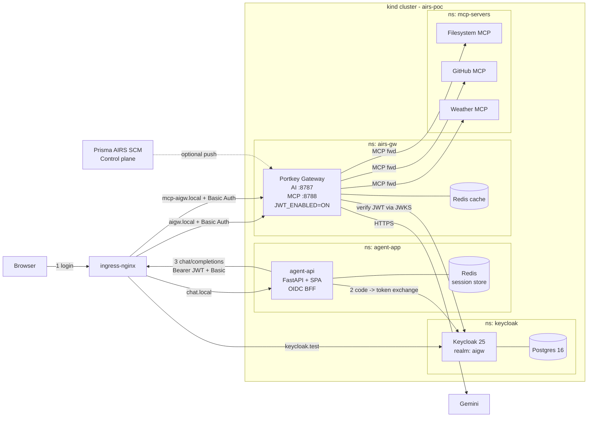
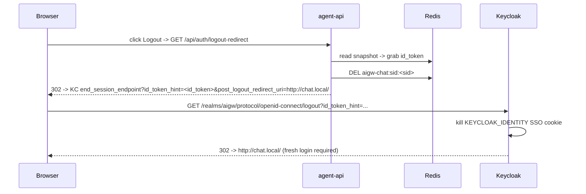
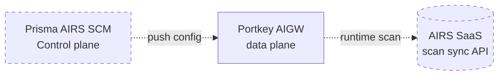

# Prisma AIRS AIGW — Hybrid Deployment POC (OIDC + JWT + Redis sessions build)

Local hybrid deployment of the **Prisma AIRS AI Gateway** (Portkey OSS data plane) on `kind`, fronted by **ingress-nginx** and **Keycloak (OIDC)**, connected to a **LangGraph agentic AI application** that talks to **3 MCP servers** (Filesystem, GitHub, Weather) and **Gemini** — everything through the gateway, nothing direct. Per-user identity flows end-to-end so **Prisma AIRS SCM policies** (Guardrails, RBAC, Rate Limits, Budgets) can be attached without code changes.

> **Note.** This build **does NOT** wire the AIRS runtime scanner into the data-plane request path by default. The gateway simply proxies. AIRS runtime protection is added later manually via the **AIGW control plane** (SCM). See §9.

One command to spin the whole thing up:

```bash
cp .env.example .env    # then edit AIGW_USER/AIGW_PASS/GEMINI_API_KEY/GITHUB_TOKEN/OPENWEATHER_API_KEY
./deploy.sh
```

---

## 1. What "hybrid" means here

| Deployment mode | Data plane | Control plane |
|---|---|---|
| **SaaS** | PANW-managed pods in Prisma Access | PANW (SCM + Portkey CP) |
| **Hybrid** | **Customer-owned pods** (your kind cluster) | PANW (SCM); Portkey CP optional |
| **Air-gapped** | Customer | Customer |

This POC = **hybrid data plane on your laptop**, no Portkey CP sync, no inline AIRS by default.
Later you flip on AIRS from the AIGW control plane; nothing in this repo changes on that path.

---

## 2. Phase roadmap

This repo has evolved through four phases. `./deploy.sh` ships **all four** in a single run.

| Phase | Adds | Namespace(s) | Key files |
|---|---|---|---|
| **0. Basic-Auth POC** | ingress-nginx Basic Auth in front of Portkey Gateway + 3 MCP servers; legacy user/pass login on the chat SPA | `airs-gw`, `mcp-servers`, `agent-app` | [`manifests/40-portkey-gateway.yaml`](manifests/40-portkey-gateway.yaml:1), [`manifests/60-ingress.yaml`](manifests/60-ingress.yaml:1) |
| **1. Keycloak OIDC (BFF)** | Keycloak 25 + Postgres 16 with realm `aigw` imported; chat SPA logs in via authorization-code + PKCE; agent-api acts as Backend-For-Frontend | `keycloak` | [`keycloak/`](keycloak/), [`agent-api/app/auth_oidc.py`](agent-api/app/auth_oidc.py:1) |
| **2. User propagation to LangGraph** | Access-token claims (`preferred_username`, `email`, `groups`) flow into per-request LLM metadata sent to Portkey (`x-portkey-metadata`) | `agent-app` | [`agent-api/app/agent_runner.py`](agent-api/app/agent_runner.py:50) |
| **3. JWT auth on Portkey** | Gateway rejects requests without a Keycloak-signed Bearer token (`JWT_ENABLED=ON`, JWKS pinned to Keycloak); per-user policies now attachable in SCM | `airs-gw` | [`manifests/40-portkey-gateway.yaml`](manifests/40-portkey-gateway.yaml:47) |
| **4. Redis session store** | agent-api sessions persisted in Redis (`aigw-chat:sid:*`) keyed by cookie; pod restarts + horizontal scale-out no longer log users out | `agent-app` | [`agent-api/app/session_store.py`](agent-api/app/session_store.py:1), [`manifests/25-redis-sessions.yaml`](manifests/25-redis-sessions.yaml:1) |

---

## 3. End-to-end architecture



### Single-turn request lifecycle (OIDC + JWT)

```mermaid
sequenceDiagram
    autonumber
    participant B as Browser
    participant API as agent-api (BFF)
    participant KC as Keycloak
    participant SESS as Redis (sessions)
    participant N as ingress-nginx (Basic)
    participant G as Portkey AIGW (JWT)
    participant O as Gemini
    B->>API: GET /  (no session cookie)
    API-->>B: 302 -> /api/auth/login
    B->>API: GET /api/auth/login
    API->>KC: 302 -> /realms/aigw/protocol/openid-connect/auth<br/>?client_id=aigw-chat&code_challenge=...
    B->>KC: username + password
    KC-->>B: 302 -> chat.local/api/auth/callback?code=...
    B->>API: GET /api/auth/callback?code=...
    API->>KC: POST /token (code + PKCE verifier + client_secret)
    KC-->>API: access_token + id_token + refresh_token
    API->>SESS: SET aigw-chat:sid:<sid> = pickled snapshot (TTL = access_token_exp - now + 30s)
    API-->>B: Set-Cookie: chatsid=<sid>; HttpOnly
    B->>API: POST /api/chat  {message}
    API->>SESS: GET aigw-chat:sid:<sid>  -> rehydrate ChatSession
    API->>N: chat/completions<br/>Authorization: Basic aigwuser:*  +  Bearer <access_token>
    N->>G: proxy
    G->>KC: fetch JWKS (cached)
    G->>G: verify signature + iss + aud=aigw-api + exp
    G->>O: forward to Gemini
    O-->>G: response
    G-->>API: response
    API->>SESS: SET aigw-chat:sid:<sid>  (append turn to history)
    API-->>B: {"reply": ...}
```

### Logout (end-to-end)



### Where AIRS lives (deferred, control-plane driven)


This POC leaves that dashed path un-wired. When you're ready, see §9.

---

## 4. Components

| Component | Image / Source | Port | Namespace | Purpose |
|---|---|---|---|---|
| ingress-nginx | [`kubernetes/ingress-nginx@1.11.2`](https://github.com/kubernetes/ingress-nginx) | 80 → * | `ingress-nginx` | Terminates every external request; enforces **Basic Auth** on AIGW hosts |
| Keycloak | `quay.io/keycloak/keycloak:25.0` | 8080 | `keycloak` | OIDC IdP; realm `aigw`; users alice/bob/kcadmin |
| Postgres (Keycloak) | `postgres:16-alpine` | 5432 | `keycloak` | Keycloak persistence (StatefulSet + PVC) |
| Portkey Gateway (AIGW) | [`portkeyai/gateway:latest`](https://hub.docker.com/r/portkeyai/gateway) | 8787 AI · 8788 MCP | `airs-gw` | AIGW data plane; **JWT_ENABLED=ON** validates Keycloak-issued Bearer tokens against `aud=aigw-api` |
| Redis (Portkey cache) | `redis:7-alpine` | 6379 | `airs-gw` | Cache + rate-limit counters for Portkey |
| Redis (session store) | `redis:7-alpine` | 6379 | `agent-app` | Persists agent-api OIDC sessions across pod restarts (**Phase 4**) |
| agent-api | local build [`agent-api/`](agent-api/) | 8000 | `agent-app` | FastAPI + SPA; OIDC **BFF** (auth-code + PKCE); LangGraph runner; per-user JWT forwarding |
| Filesystem MCP | [`supercorp/supergateway`](https://github.com/supercorp-ai/supergateway) + [`@modelcontextprotocol/server-filesystem`](https://github.com/modelcontextprotocol/servers/tree/main/src/filesystem) | 8080 | `mcp-servers` | Read/list files in `/data` |
| GitHub MCP | [`ghcr.io/github/github-mcp-server`](https://github.com/github/github-mcp-server) | 8080 | `mcp-servers` | Repos, issues, PRs |
| Weather MCP | Local build [`mcp-weather/`](mcp-weather/) (Python `FastMCP`) | 8080 | `mcp-servers` | `get_weather(city)` via OpenWeather |
| LangGraph Agent (CLI) | [`agent/`](agent/) | — | runs on laptop | Legacy Basic-Auth smoke-test client (`make test`, `make agent`) |

---

## 5. Prerequisites

| Tool | Install |
|---|---|
| Docker Desktop | https://www.docker.com/products/docker-desktop |
| kind ≥ 0.20 | `brew install kind` |
| kubectl ≥ 1.28 | `brew install kubectl` |
| Python 3.11+ | `brew install python@3.11` |
| htpasswd (optional) | `brew install httpd` — if missing, `deploy.sh` falls back to Python `bcrypt` |
| `jq` (optional) | `brew install jq` — used by smoke-test snippets |
| `sudo` | needed once to write `/etc/hosts` |

Credentials for `.env` (see [`.env.example`](.env.example:1) for the full list):

| Env var | Purpose |
|---|---|
| `AIGW_USER` / `AIGW_PASS` | Basic Auth username/password at the ingress (you choose) |
| `CHAT_USER` / `CHAT_PASS` | Legacy password fallback for the chat SPA (`?legacy=1`) |
| `CHAT_SESSION_SECRET` | Cookie-signing key (auto-generated if not set) |
| `GEMINI_API_KEY` | Upstream LLM key that AIGW forwards to Gemini |
| `GITHUB_TOKEN` | GitHub PAT (repo:read) — used by GitHub MCP + AIGW header injection |
| `OPENWEATHER_API_KEY` | Free key from https://openweathermap.org/api |
| `OIDC_CLIENT_ID` / `OIDC_CLIENT_SECRET` | OIDC client for agent-api; defaults to `aigw-chat` + the seeded realm secret |

---

## 6. Quick start

```bash
cd /path/to/AIGW

# 1. secrets
cp .env.example .env      # then edit and set the required values

# 2. deploy (idempotent - safe to re-run)
./deploy.sh

# 3. open the chat UI (OIDC login via Keycloak)
open http://chat.local/
#    Try alice / alice   (group: gemini-users)
#    Try bob   / bob     (no groups - should be denied once SCM policy is attached)
#    Try kcadmin / kcadmin (groups: admins + gemini-users)

# 4. legacy smoke-tests (Basic Auth path, no OIDC)
python3 -m venv .venv && source .venv/bin/activate
pip install -r agent/requirements.txt
make test        # 5 legacy smoke tests
make agent       # legacy interactive REPL
```

Everything is exposed on `http://` locally through `/etc/hosts`:

| URL | Namespace / Service |
|---|---|
| http://chat.local/ | agent-api (OIDC-protected SPA) |
| http://chat.local/?legacy=1 | agent-api (legacy password login) |
| http://keycloak.test/ | Keycloak admin console (admin / kc-admin-poc-CHANGE-ME) |
| http://aigw.local/v1/... | Portkey AI Gateway (Basic Auth + Bearer JWT) |
| http://mcp-aigw.local/{filesystem,github,weather}/mcp | Portkey MCP Gateway |

---

## 7. Seeded Keycloak users (POC only)

| Username | Password | Groups | Purpose |
|---|---|---|---|
| `alice` | `alice` | `gemini-users` | Happy-path Gemini caller |
| `bob` | `bob` | (none) | Should be denied by SCM RBAC / Guardrail policy |
| `kcadmin` | `kcadmin` | `admins`, `gemini-users` | Budget-bypass admin path |

Master realm admin (Keycloak console): `admin / kc-admin-poc-CHANGE-ME`.

**Rotate everything before non-POC use.** Passwords + client secret live in:
- [`keycloak/01-postgres-secret.yaml`](keycloak/01-postgres-secret.yaml:1) — `POSTGRES_PASSWORD`
- [`keycloak/03-keycloak-secret.yaml`](keycloak/03-keycloak-secret.yaml:1) — `KEYCLOAK_ADMIN_PASSWORD` + `OIDC_CLIENT_SECRET`
- [`keycloak/04-realm-import-configmap.yaml`](keycloak/04-realm-import-configmap.yaml:1) — same `secret` for the `aigw-chat` client + all user passwords

Any change to the `aigw-chat.secret` in the realm JSON MUST match the `OIDC_CLIENT_SECRET` used by agent-api (see [`.env.example`](.env.example:1) and [`manifests/70-agent-api.yaml`](manifests/70-agent-api.yaml:1)).

---

## 8. Runbook cheat sheet

```bash
make up                 # ./deploy.sh
make down               # ./teardown.sh
make status             # pods, services, ingress across all 4 namespaces
make logs               # tail every workload
make logs-gw            # gateway only
make logs-mcp           # all 3 MCP servers
make curl-health-noauth # legacy Basic-Auth negative test: should print 401
make curl-health        # legacy Basic-Auth positive test: should print 200
make test               # 5 legacy smoke tests (Basic Auth path)
make agent              # legacy CLI REPL
make reload-config      # apply edits to configs/portkey-config.json + rollout restart

# OIDC smoke: direct-grant token for alice, decoded to JSON
curl -s -X POST http://keycloak.test/realms/aigw/protocol/openid-connect/token \
  -d 'grant_type=password&client_id=aigw-chat&client_secret=aigw-chat-client-secret-CHANGE-ME&username=alice&password=alice&scope=openid email aigw-api' \
  | jq -r .access_token | cut -d. -f2 | base64 -d 2>/dev/null | jq

# Redis session inspection (Phase 4)
kubectl -n agent-app exec deploy/redis -- redis-cli KEYS 'aigw-chat:sid:*'
kubectl -n agent-app exec deploy/redis -- redis-cli TTL  'aigw-chat:sid:<sid>'

# Session-survival test (Phase 4)
kubectl -n agent-app rollout restart deploy/agent-api
# Reload http://chat.local/ in the browser -> should stay logged in.
```

---

## 9. Troubleshooting quick table

| Symptom | Where to look |
|---|---|
| `deploy.sh` fails at Step 7/12 waiting for `statefulset/keycloak` | `kubectl -n keycloak logs statefulset/keycloak` — first boot runs realm import + JPA migration and takes ~2 min. Increase the timeout or re-run. |
| Chat SPA redirects to Keycloak but Keycloak returns "Invalid redirect_uri" | The `aigw-chat` client's `redirectUris` in [`keycloak/04-realm-import-configmap.yaml`](keycloak/04-realm-import-configmap.yaml:37) must include `http://chat.local/api/auth/callback`. Realm import only runs on first boot — if you edited it, clear the DB or use kcadm.sh. |
| Portkey returns 401 on every `/v1/*` call after Phase 3 | JWT_ENABLED=ON but the Bearer JWT is missing/invalid. Check `kubectl -n airs-gw logs deploy/portkey-gateway` and confirm the JWKS URL `http://keycloak.keycloak.svc.cluster.local:8080/realms/aigw/protocol/openid-connect/certs` is reachable from the pod. |
| Logout dumps user back into the chat as the same user | The old logout-race bug. Confirm the SPA is calling `/api/auth/logout-redirect` (GET, full-page navigation) not the JSON `/api/logout`. Check agent-api logs for `id_token_hint=yes`. |
| agent-api pod restart -> user has to log in again | Redis session-store isn't wired. Confirm `REDIS_URL` env is set on the deployment and `kubectl -n agent-app get deploy/redis` is Ready. |
| Ingress 404 on `chat.local` or `keycloak.test` | `/etc/hosts` missing the entry. `deploy.sh` adds `127.0.0.1 aigw.local mcp-aigw.local chat.local keycloak.test` — re-run if you skipped the sudo prompt. |
| `make curl-health-noauth` returns 200 not 401 | Basic-Auth ingress annotations missing. `kubectl -n airs-gw describe ingress aigw-ingress` — the `basic-auth` secret must exist in the `airs-gw` namespace. |
| Gateway pod crashloop | `kubectl -n airs-gw logs deploy/portkey-gateway` |
| MCP call errors | `kubectl -n mcp-servers logs deploy/mcp-weather -f` (or `mcp-github`, `mcp-filesystem`) |

---

## 10. Connecting the data plane to Prisma AIRS SCM (manual, post-deploy)

`./deploy.sh` intentionally ships the AIGW data plane in **standalone** mode
(env `MANAGED_DEPLOYMENT=OFF`, `ANALYTICS_STORE=local`, `LOG_STORE=local`, no
`ALBUS_BASEPATH`, no `PORTKEY_CLIENT_AUTH`). Nothing in the script talks to
SCM. The AIRS integration is wired **manually in the SCM UI + one kubectl
patch** on your side after the deploy succeeds.

### 10.1 The two connections you're about to create

| Channel | Direction | Purpose | Enabled by |
|---|---|---|---|
| **A. Config push** | SCM → data plane | SCM pushes the gateway config (providers, virtual keys, guardrail hooks, MCP registrations, budgets, rate limits) to your Portkey pod every 60s | `MANAGED_DEPLOYMENT=ON` + `PORTKEY_CLIENT_AUTH` + `ORGANISATIONS_TO_SYNC` + `ALBUS_BASEPATH` env vars on the data plane |
| **B. Runtime AIRS scan** | data plane → AIRS SaaS | Per-request prompt/response guardrail evaluation using your existing AI Profile | `before_request_hooks` / `after_request_hooks` inside the config pushed by SCM in step (A) |

### 10.2 Step M1 — Register the gateway in SCM

1. Open **Strata Cloud Manager → AI Runtime Security → AI Gateway → Gateways → Onboard Gateway (Hybrid)**.
2. Give the gateway a name (e.g. `airs-poc-laptop`) and copy the 3 values SCM issues:
   - `ORGANISATIONS_TO_SYNC`
   - `PORTKEY_CLIENT_AUTH`
   - `ALBUS_BASEPATH` (typically `https://albus.portkey.ai`)
3. Load them into a Secret and patch the gateway:

```bash
kubectl -n airs-gw create secret generic scm-cp-creds \
  --from-literal=PORTKEY_CLIENT_AUTH="<paste-from-SCM>" \
  --from-literal=ORGANISATIONS_TO_SYNC="<paste-from-SCM>" \
  --from-literal=ALBUS_BASEPATH="https://albus.portkey.ai" \
  --dry-run=client -o yaml | kubectl apply -f -

kubectl -n airs-gw patch deploy portkey-gateway --type=strategic -p '{
  "spec":{"template":{"spec":{"containers":[{
    "name":"gateway",
    "env":[
      {"name":"MANAGED_DEPLOYMENT","value":"ON"},
      {"name":"PORTKEY_CLIENT_AUTH","valueFrom":{"secretKeyRef":{"name":"scm-cp-creds","key":"PORTKEY_CLIENT_AUTH"}}},
      {"name":"ORGANISATIONS_TO_SYNC","valueFrom":{"secretKeyRef":{"name":"scm-cp-creds","key":"ORGANISATIONS_TO_SYNC"}}},
      {"name":"ALBUS_BASEPATH","valueFrom":{"secretKeyRef":{"name":"scm-cp-creds","key":"ALBUS_BASEPATH"}}}
    ]
  }]}}}
}'

kubectl -n airs-gw rollout status deploy/portkey-gateway
kubectl -n airs-gw logs deploy/portkey-gateway -f | grep -iE "sync|albus|control[- ]plane"
```

### 10.3 Step M2 — Attach AI Profile + per-user policies

Because Phase 3 ships user identity in the JWT (`preferred_username`, `email`, `groups`), you can now attach SCM policies keyed on those claims:

- **Guardrail deny** for `groups NOT CONTAINS gemini-users` → bob is blocked, alice is allowed.
- **Rate Limit** per `preferred_username` → per-user quotas.
- **Budget** per `groups` → tenant-level cost caps.
- **Conditional Routing** to a cheaper model for non-admin groups.

Attach the AI Profile in SCM: **AI Security → AI Gateways → `<your gateway>` → Policies → Attach AI Profile → Save + Push**.

### 10.4 Step M3 — Confirm

```bash
# Tail the gateway to see guardrail decisions
kubectl -n airs-gw logs deploy/portkey-gateway -f | grep -iE "airs|guardrail|verdict"

# Then in the chat UI (http://chat.local):
#  * log in as alice -> "Hello" should succeed
#  * log in as bob   -> should be denied by the group-based Guardrail
```

Cross-check in **SCM → AI Security → Activity** — filter by `app_name = airs-aigw-poc` (the `SERVICE_NAME` env in [`manifests/40-portkey-gateway.yaml`](manifests/40-portkey-gateway.yaml:54)). Every scanned prompt/response shows up there with the AIRS category, verdict, and the resolved `preferred_username` / `groups`.

### 10.5 Rolling back the SCM connection

```bash
kubectl -n airs-gw patch deploy portkey-gateway --type=strategic -p '{
  "spec":{"template":{"spec":{"containers":[{
    "name":"gateway",
    "env":[
      {"name":"MANAGED_DEPLOYMENT","value":"OFF"},
      {"name":"PORTKEY_CLIENT_AUTH","value":null},
      {"name":"ORGANISATIONS_TO_SYNC","value":null},
      {"name":"ALBUS_BASEPATH","value":null}
    ]
  }]}}}
}'
kubectl -n airs-gw delete secret scm-cp-creds --ignore-not-found
kubectl -n airs-gw rollout restart deploy/portkey-gateway
```

Gateway falls back to the local [`configs/portkey-config.json`](configs/portkey-config.json:1) ConfigMap (no guardrails).

### 10.6 Egress the data plane needs to reach

For channels (A) and (B) to work, the pod must reach:

| Host | Purpose |
|---|---|
| `albus.portkey.ai` | SCM config sync (channel A) |
| `api.portkey.ai` | SCM analytics + guardrail plugin fetch (channel A) |
| `service.api.aisecurity.paloaltonetworks.com` | AIRS runtime scan (channel B) |
| `generativelanguage.googleapis.com` | Gemini upstream (LLM traffic) |

On Docker Desktop / kind this is already open by default. In a real production cluster, add these to your egress allowlist.

---

## 11. Migrating the POC to production

| POC choice | Production replacement |
|---|---|
| kind on laptop | GKE / EKS / AKS multi-AZ |
| Keycloak StatefulSet on kind | Keycloak Operator on prod cluster, or SaaS IdP (Okta, Auth0, Azure AD) — swap `OIDC_ISSUER` + `OIDC_JWKS_URL` only |
| Postgres StatefulSet (kind local-path) | Cloud SQL / RDS / AlloyDB with backups |
| In-cluster Redis (session store, ephemeral) | GCP Memorystore / AWS ElastiCache — swap `REDIS_URL` only |
| In-cluster Redis (Portkey cache, ephemeral) | Same as above, separate instance |
| ingress-nginx Basic Auth on AIGW | Keep the Bearer-JWT layer (Phase 3); remove Basic-Auth once JWT is trusted end-to-end, or keep both as belt-and-braces |
| Local `config.json` ConfigMap | Portkey CP sync (`PORTKEY_CLIENT_AUTH` + `ORGANISATIONS_TO_SYNC`) or SCM-driven push |
| `LOG_STORE=local` | `LOG_STORE=gcs_assume` / `s3` + streaming to SLS |
| No AIRS in data plane | Attach AIRS AI Profile via SCM; enable inline guardrails |
| Single-tenant | Per-tenant namespace + per-tenant Keycloak realm + per-tenant SCM AI Profile |
| Realm JSON with hard-coded secrets | External Secrets Operator + Vault / GCP Secret Manager |
